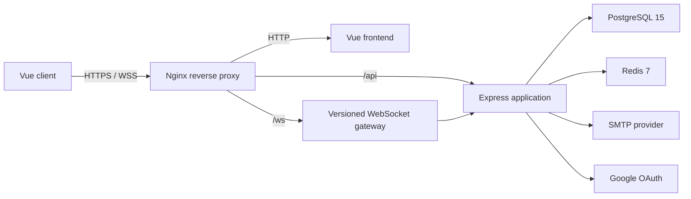
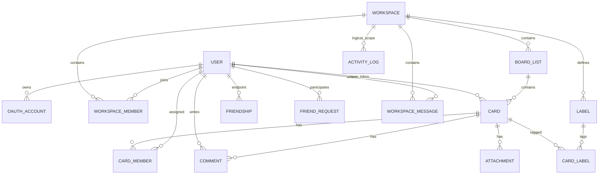

*This project has been created as part of the 42 curriculum by ynam, chakim, yeonjuki, injo, wchoe.*

# TaskFlow

## Description

TaskFlow is a Trello-inspired collaboration prototype for organizing work in
role-based workspaces. It combines a Kanban board, a personal card inbox,
calendar views, invitations, workspace chat, presence, and realtime
synchronization in one Docker Compose application.

The project intentionally favors a compact, reviewable prototype over a
production-scale platform. Realtime transport is isolated behind a versioned
WebSocket protocol so future features can be added without coupling them to the
HTTP controllers or the Vue component tree.

### Key features

- Email/password authentication and Google OAuth 2.0 login.
- Rotating Redis-backed refresh sessions and short-lived JWT access tokens.
- Public and private workspaces with `OWNER`, `ADMIN`, `MEMBER`, and `VIEWER`
  roles.
- Redis-backed, one-time email invitation links accepted by any signed-in account.
- Kanban lists and cards with drag-and-drop reordering.
- Realtime list-level board synchronization across workspace members.
- Editable card titles, descriptions, start dates, and deadlines.
- A personal Inbox controlled from the workspace toolbox, rendered as a left
  split sidebar beside Board or Calendar on desktop and a focused full-page
  view on mobile. Desktop supports direct drag-and-drop between Inbox and board
  lists, including horizontal edge scrolling.
- A calendar that renders card start/deadline ranges as continuous weekly bars,
  plus advanced search across accessible workspaces, cards, labels, and people.
  Search supports mouse-selectable scopes, `/keyword` and slash-command filters,
  relevance/newest/name sorting, and URL-backed pagination.
- A workspace activity dashboard with selectable 7/30/90/365-day ranges,
  date-labelled contribution and issue-flow charts, current completion
  metrics, activity breakdowns, and a recent activity feed.
- Email-based friend requests with acceptance/rejection and realtime
  online/offline presence for accepted friends.
- A full messenger with workspace rooms, accepted-friend DMs, friend
  management, and realtime online status. On desktop it toggles from the right
  and its right-side directory rail can collapse to return space to the board;
  mobile uses a full-page view above the persistent bottom bar. Session-scoped
  unread counts for workspace messages, DMs, and workspace activity appear on
  each room and on the messenger header and workspace toolbox, capped visually
  at `99+`.
- Card-linked workspace messages that are also stored and displayed as card
  comments, direct comment writing from card details, and realtime team-member
  online status.
- Realtime workspace-member-joined activity folded into the related workspace
  room's unread count without a separate notification tab.
- HTTPS and WSS through Nginx, backed by PostgreSQL and Redis.

## Architecture



The REST API and PostgreSQL own durable application state. The realtime layer
authenticates the same users and publishes invalidation hints, chat delivery,
presence, and notification events. Browsers refetch only affected list
snapshots and perform a full snapshot reconciliation after reconnecting. Redis
stores refresh sessions, mail jobs, and invitation rate-limit counters.
Prototype channels and presence are intentionally held in one backend process.

## Instructions

### Prerequisites

- Docker Engine 24 or newer.
- Docker Compose v2.20 or newer.
- A browser that supports WebSockets.
- Google OAuth client credentials to test Google login.
- SMTP credentials to send workspace invitations.

The containers pin the main runtime families used by the project:
Node.js 20, PostgreSQL 15, Redis 7, and Nginx stable Alpine. A host Node.js
installation is only needed when running tests outside Docker.

### 1. Configure the environment

```bash
cp .env.dev.example .env.dev
```

Set every non-default value in `.env.dev`:

| Variable | Purpose |
| --- | --- |
| `POSTGRES_USER`, `POSTGRES_PASSWORD`, `POSTGRES_DB` | Credentials for the environment-specific PostgreSQL container |
| `DATABASE_URL` | Backend connection URL using the same PostgreSQL credentials |
| `GOOGLE_CLIENT_ID` | Google OAuth web client ID |
| `GOOGLE_CLIENT_SECRET` | Google OAuth client secret |
| `GOOGLE_REDIRECT_URI` | Exact registered callback; local default is `https://localhost:4430/oauth/google` |
| `APP_ORIGIN` | Canonical browser origin; local default is `https://localhost:4430` |
| `JWT_ACCESS_SECRET` | Random secret of at least 32 characters |
| `SMTP_HOST`, `SMTP_PORT` | SMTP server and port |
| `SMTP_USER`, `SMTP_PASS` | SMTP credentials |
| `SMTP_FROM` | Sender shown on invitation messages |
| `OAUTH_AUTO_LINK_VERIFIED_EMAIL` | Toy-project option for linking a verified Google email to an existing local user |
| `WS_*` | Optional WebSocket timeout, heartbeat, payload, and rate-limit tuning |
| `ALLOW_DB_SEED` | Explicit development-only seed guard; keep this `false` in production |

A suitable development JWT secret can be generated with:

```bash
openssl rand -base64 48
```

Placeholder Google and SMTP values are enough to exercise password
authentication and the board locally, but their related integrations will not
work until valid credentials are supplied.

### 2. Register the OAuth callback

Create a Google OAuth 2.0 Web application and add this authorized redirect URI:

```text
https://localhost:4430/oauth/google
```

The canonical backend route
`/api/auth/oauth/callback/google` is also supported. For any external
deployment, register the exact public HTTPS callback and update both
`APP_ORIGIN` and `GOOGLE_REDIRECT_URI`.

### 3. Build and run

```bash
make dev-up
make dev-seed
```

The backend entrypoint generates the Prisma client and applies pending
migrations automatically. Nginx generates a self-signed development
certificate when no certificate is mounted.

The seed command creates two workspaces with role-based members, 24 board and
Inbox cards, relative Calendar dates, Dashboard activity, labels, comments,
attachments, friendships, requests, workspace messages, and DMs.
The dates are recalculated around the day the seed runs so recent activity and
upcoming work remain visible.

All fixture accounts use `DEV_SEED_PASSWORD` from `.env.dev`:

| Role/scenario | Email |
| --- | --- |
| Product workspace `OWNER` | Value of `DEV_SEED_EMAIL` (`dev@local.test` by default) |
| Product workspace `ADMIN` | `alex.admin@local.test` |
| Product workspace `MEMBER` | `mina.member@local.test` |
| Product workspace `VIEWER` | `joon.viewer@local.test` |
| Public non-member and pending request | `guest.pending@local.test` |

Repeated seed runs restore fixed fixture records without deleting unrelated
user-created workspaces or cards. They do reset activity history for the two
fixture workspaces so the Dashboard remains deterministic. Never run the seed
against production.

Open:

- Application: `https://localhost:4430`
- Health check: `https://localhost:4430/api/health`

The browser will warn about the self-signed local certificate. Accept it only
for this development environment.

Useful lifecycle commands:

```bash
make dev-logs
make dev-down
```

`make`, `make up`, `make down`, and `make logs` remain aliases for the
development commands. `make dev-reset` removes only the `taskflow-dev`
containers and volumes and therefore deletes all development data.

### 4. Run Production

Create a separate production environment file and replace every placeholder:

```bash
cp .env.prod.example .env.prod
make prod-up
```

Production uses compiled backend and frontend images without source mounts.
Its PostgreSQL and Redis volumes belong to the separate `taskflow-prod`
Compose project, so development resets cannot delete production data. Use
`make prod-logs` and `make prod-down` for its lifecycle.

With the default `TLS_CERT_DIR=./.taskflow/tls`, Nginx creates a self-signed
localhost certificate when the directory does not contain one. To use a domain
certificate later, place its files at `fullchain.pem` and `privkey.pem` in a
dedicated host directory, set `TLS_CERT_DIR` to that directory, and restart the
production services. Also update `APP_ORIGIN` and `GOOGLE_REDIRECT_URI` to the
exact public HTTPS domain. Never enable `ALLOW_DB_SEED` in production.

### 5. Run checks

```bash
cd backend
npm install
npm run typecheck
npm test

cd ../frontend
npm install
npm test
npm run build
```

Backend integration tests create local HTTP and WebSocket listeners, so the
environment running the suite must allow loopback port binding.

## Basic usage

1. Create an account or sign in with Google.
2. Create a private or public workspace.
3. Add lists and cards, then drag them to reorder or move them.
4. Open a card to edit its details and dates.
5. Open Inbox from the bottom workspace toolbox. On desktop, use its split
   sidebar beside Board or Calendar and drag cards between Inbox and board
   lists. Dropping a board card directly on the closed Inbox tool moves it
   without opening the sidebar; on mobile, use the focused Inbox page.
6. Invite a registered or future user by email from the workspace share menu.
7. Toggle Chat from the bottom toolbox, then choose a workspace room, manage
   friends, or start a DM. On desktop it opens as a right sidebar whose
   directory rail can collapse; on mobile it becomes a full page.
8. Select a card, or drop a board card onto the open right-side workspace chat,
   before sending a message to also record that text in the card's comments.
   Dropping onto the closed Chat tool opens the current workspace room with
   that card already attached.
9. See team online status and member management from the workspace top bar,
   search accessible workspaces, cards, labels, and people with filters,
   sorting, and pagination, or use the bottom toolbox to switch between the
   board, Calendar, Dashboard, and workspace list.
10. Use a card's Complete/Reopen action to change its own completion state
    without moving it. List completion markers are optional visual hints only;
    the dashboard history follows the card state.

Workspace permissions are deliberately small:

| Role | Read board | Workspace chat | Edit lists/cards | Invite/manage members | Edit workspace | Delete workspace |
| --- | :---: | :---: | :---: | :---: | :---: | :---: |
| Public non-member | Yes | No | No | No | No | No |
| `VIEWER` | Yes | Yes | No | No | No | No |
| `MEMBER` | Yes | Yes | Yes | No | No | No |
| `ADMIN` | Yes | Yes | Yes | Yes | Yes | No |
| `OWNER` | Yes | Yes | Yes | Yes | Yes | Yes |

OWNER and ADMIN can assign `ADMIN`, `MEMBER`, or `VIEWER` to eligible
non-owner members from the team-management dialog. The OWNER role itself is
not editable there; ownership transfer remains a separate workflow, and an
ADMIN cannot change an OWNER. The service also prevents removing the final
owner.

## Technical stack

| Area | Technology | Why it was selected |
| --- | --- | --- |
| Frontend | Vue 3, TypeScript, Vite, Vue Router | Small component model, strong typing, and fast prototype iteration |
| Styling | Tailwind CSS plus project CSS | Fast layout work while keeping reusable component styles |
| Board interaction | `vuedraggable` | Browser drag-and-drop with a small Vue integration surface |
| Backend | Express 5, TypeScript, Zod | Minimal HTTP framework with explicit validation and readable services |
| Realtime | `ws` with a versioned JSON envelope | Direct control over authentication, heartbeat, routing, and future event handlers |
| ORM | Prisma | Typed PostgreSQL queries, migrations, relations, and transactions |
| Durable storage | PostgreSQL 15 | Relational integrity for workspaces, roles, boards, and audit data |
| Ephemeral storage | Redis 7 | Refresh sessions, mail queue, and invitation throttling |
| Authentication | JWT, Node `scrypt`, Google OAuth/OIDC | Stateless access checks plus revocable sessions and social login |
| Email | Nodemailer | Provider-neutral SMTP invitation delivery |
| Edge/runtime | Nginx and Docker Compose | One HTTPS/WSS entrypoint and reproducible local services |
| Testing | Node test runner and Vitest | Lightweight backend integration/unit tests and frontend behavior tests |

## Database schema



The Prisma models map to plural PostgreSQL table names. `ActivityLogs` is
created and populated by a SQL trigger migration, then exposed through a
read-only Prisma model for dashboard aggregation.

| Table | Important fields and types | Relationship or rule |
| --- | --- | --- |
| `Users` | `id UUID`, `email String`, `password_hash String?`, `name String`, `profile_image_url String?` | Email is unique; OAuth-only users may have no password hash |
| `OAuthAccounts` | `id UUID`, `user_id UUID`, `provider String`, `provider_id String` | Unique provider/provider ID pair |
| `Friendships` | `user_low_id UUID`, `user_high_id UUID`, `created_at DateTime` | Sorted composite key represents one undirected friendship |
| `FriendRequests` | `user_low_id UUID`, `user_high_id UUID`, `requested_by_id UUID`, `created_at DateTime` | Canonical pending pair; deleted on accept, reject, or cancel |
| `DirectMessages` | `id UUID`, `sender_user_id UUID`, `recipient_user_id UUID`, `content Text`, `created_at DateTime` | Append-only messages; API access requires the friendship to remain accepted |
| `Workspaces` | `id UUID`, `name String`, `is_public Boolean` | Parent of members, lists, and labels |
| `WorkspaceMembers` | `workspace_id UUID`, `user_id UUID`, `role Role` | Composite key; role is `OWNER`, `ADMIN`, `MEMBER`, or `VIEWER` |
| `WorkspaceMessages` | `id UUID`, `workspace_id UUID`, `user_id UUID`, `card_id UUID?`, `content Text`, `created_at DateTime` | Append-only default-room messages; an optional card link is cleared if the card is deleted |
| `Lists` | `id UUID`, `workspace_id UUID`, `name String`, `sequence Float`, `is_done Boolean` | Fractional sequence supports reordering; `is_done` is a visual workflow marker |
| `Cards` | `id UUID`, `list_id UUID?`, `user_id UUID?`, `title String`, `description Text`, `is_completed Boolean`, `start_at DateTime?`, `deadline DateTime?`, `sequence Float` | A null `list_id` denotes a personal inbox card; completion is independent from list position |
| `Labels` | `id UUID`, `workspace_id UUID`, `label_name String`, `label_color String` | Labels are workspace-scoped |
| `CardLabels` | `label_id UUID`, `card_id UUID` | Composite card-to-label relation |
| `Attachments` | `id UUID`, `card_id UUID`, `file_url String?`, `file_name String?` | Stores URL metadata, not uploaded file bytes |
| `Comments` | `id UUID`, `card_id UUID`, `user_id UUID`, `comment_str String` | Card comment records |
| `ActivityLogs` | `id UUID`, `workspace_id UUID`, `actor_user_id UUID?`, `operation enum`, `event_type enum`, `target_type enum`, `target_id Text`, `transaction_id BigInt` | Append-only workspace activity records written by triggers |

Most domain models also carry `created_at/by`, `updated_at/by`, and
`deleted_at/by` audit fields. Soft-deleted rows remain available for audit
history but are filtered from normal application reads.

## Features and contributors

Git history uses several aliases. The table preserves those aliases instead of
guessing an identity where the repository does not prove one.

| Feature | Implementation summary | Repository contributors |
| --- | --- | --- |
| Authentication and account | Password login, Google OAuth, refresh rotation, account edit/delete | `Sean Kim`; frontend integration by `KHR416` / `wchoe` |
| Workspace and permissions | CRUD, role checks, member removal, final-owner guard, public data projection | `Saususge`, `copilot-swe-agent[bot]`, `seankim96` |
| Email invitations | One-time Redis invitation, explicit account confirmation, mail queue, per-address limit | `Saususge`, `seankim96` |
| Lists and cards | Prisma services, ordering, drag-and-drop, details and dates | `injo`, `yeonjunky`, `KHR416`, `seankim96` |
| Personal inbox | API-backed cards, board/inbox drag round trip, and edge scrolling | `seankim96` |
| Calendar and search | Range-bar workspace calendar plus scoped `/keyword` search with people discovery, filters, sorting, and pagination | `seankim96`, building on the initial UI by `KHR416` |
| Activity dashboard | Selectable-period trigger-backed contribution heatmap, dated activity feed, issue flow, completion metrics, and list/activity charts | `seankim96` |
| Friends, DMs, and presence | Request/accept flow, symmetric friendships, direct messages, unified messenger, and online/offline events | `seankim96` |
| Realtime foundation | Authenticated protocol, reconnect, refresh, heartbeat, limits, routing, drain | `seankim96` |
| Workspace realtime and chat | Member-only channels, targeted list reconciliation, team presence, and persistent group chat | `seankim96` |
| Infrastructure | Docker services, HTTPS/WSS Nginx proxy, migrations | `ynam` / `nyhwbh`, `yeonjunky` / `yeonjunkim` |
| Database and activity audit | Core schema, migrations, trigger-based activity log | `injo`, `seankim96` |

## Team information

The project planning document records the following 42 team:

| Login | Role | Main responsibility |
| --- | --- | --- |
| `ynam` | Product Owner | Product direction, requirements, priorities, and initial environment |
| `chakim` | Project Manager | Planning workflow, coordination, workspace/member and invitation workstream |
| `yeonjuki` | Tech Lead | Backend structure, infrastructure decisions, card module, and technical review |
| `injo` | Developer | Relational schema, Prisma list/card services, and drag-and-drop board integration |
| `wchoe` | Developer | Vue UI structure, routing, shared components, API integration, and frontend hardening |

Repository aliases are not perfectly normalized: `ynam` also appears as
`nyhwbh`; `yeonjuki` appears as `yeonjunky`/`yeonjunkim`; `injo` also appears
under a Korean display name; and `wchoe` shares commit history with `KHR416`.
Workspace commits under `Saususge` and integration commits under
`Sean Kim`/`seankim96` are not conclusively mapped to the five planning logins
by files in this repository.

## Project management

- The shared Trello board was the planning source of truth.
- Cards moved through `Backlog` → `To-do` → `WIP` → `Review` → `Done`.
- Contributor-colored labels identified ownership; `Waiting` marked blockers
  and `Stretch` marked lower-priority goals.
- Work was split into two-to-three-day checklist items, implemented on feature
  branches, and moved to review with relevant links and context on the card.
- GitHub branches, pull requests, and commit history carried code integration
  and review.
- Trello card descriptions and activity comments preserved asynchronous
  technical decisions. The exact voice/chat channel and meeting cadence were
  handled outside the repository and are therefore not asserted here.

## Modules

This table claims only modules that the current source can demonstrate. Module
acceptance and scoring remain the evaluator's decision.

| Module | Level | Points | Justification and implementation | Contributors |
| --- | --- | ---: | --- | --- |
| Use a frontend and backend framework | Major | 2 | Vue 3 frontend and Express 5 backend, both in TypeScript | `wchoe`, `yeonjuki`, `injo`, `Saususge`, `Sean Kim` |
| Realtime features with WebSockets | Major | 2 | Authenticated WSS protocol, presence, and member-join events | `seankim96` |
| Use an ORM | Minor | 1 | Prisma schema, relations, transactions, and migrations over PostgreSQL | `injo`, `Saususge`, `KHR416` |
| OAuth 2.0 authentication | Minor | 1 | Google Authorization Code flow with state, nonce, ID-token verification, and account linking policy | `Sean Kim` |
| Organization system | Major | 2 | Isolated workspaces, memberships, roles, invitations, and board resources | `Saususge`, `injo`, `KHR416`, `seankim96` |
| Advanced realtime data visualization | Major | 2 | Trigger-backed activity analytics with live invalidation, a contribution heatmap, issue-flow charts, and current completion metrics | `seankim96` |
| Advanced search | Minor | 1 | Workspace-scoped card and label filters, people discovery, slash commands, relevance/newest/name sorting, and URL-backed pagination | `seankim96` |
| **Currently defensible total** |  | **11** | Does not count incomplete planned modules |  |

The planning document also considered chat/user interaction, full profile
management, advanced permission administration, realtime collaboration,
file upload, and a public API. They are not claimed
because the current prototype does not implement their complete subject
requirements.

## Individual contributions and challenges

### ynam — Product Owner

- Established the initial environment, repository identity, and product scope.
- Kept the product centered on a Trello-like workflow.
- Challenge: balancing a broad module plan with a deliverable prototype.
  Resolution: prioritized the workspace and board flow as the product core.

### chakim — Project Manager

- Defined the Trello workflow, ownership labels, blocker handling, and
  invitation workstream in the project plan.
- Coordinated workspace/member management requirements.
- Challenge: invitations span authorization, email, and account lifecycle.
  Resolution: used expiring, one-time bearer links with explicit account
  confirmation and a queued SMTP send.

### yeonjuki — Tech Lead

- Structured backend modules and contributed card-domain foundations.
- Implemented the HTTPS Nginx reverse proxy and local certificate workflow
  under the repository aliases `yeonjunky`/`yeonjunkim`.
- Challenge: serving frontend, REST, OAuth callback, and WSS from one origin.
  Resolution: routed them through a single Nginx TLS entrypoint.

### injo — Developer

- Created the initial Prisma schema and migrations.
- Implemented list/card persistence and integrated API-backed drag-and-drop.
- Challenge: stable ordering without rewriting every sibling.
  Resolution: used fractional sequence values and transactional checks.

### wchoe — Developer

- Built and reorganized the Vue UI, routes, shared components, and API client.
- Removed initial mock dependencies and hardened board/API error paths under
  the `KHR416` and `wchoe` aliases.
- Challenge: keeping role-dependent controls consistent with backend rules.
  Resolution: centralized authenticated requests and rendered write actions
  only for roles that can perform them.

### Integration history

Later authentication, realtime, and prototype-completion commits appear as
`Sean Kim`/`seankim96`, with automation co-author records on selected changes.
Because the repository does not prove how this alias maps to the planning
logins, this work is kept explicit instead of being silently attributed to a
team member.

## Resources

Primary references used while designing and implementing the project:

- [Vue documentation](https://vuejs.org/guide/introduction.html)
- [Vue Router documentation](https://router.vuejs.org/)
- [Express documentation](https://expressjs.com/)
- [Prisma documentation](https://www.prisma.io/docs)
- [PostgreSQL documentation](https://www.postgresql.org/docs/15/)
- [Redis documentation](https://redis.io/docs/latest/)
- [MDN WebSocket API](https://developer.mozilla.org/en-US/docs/Web/API/WebSocket)
- [RFC 6455: The WebSocket Protocol](https://www.rfc-editor.org/rfc/rfc6455)
- [OWASP WebSocket Security Cheat Sheet](https://cheatsheetseries.owasp.org/cheatsheets/WebSocket_Security_Cheat_Sheet.html)
- [Google OAuth 2.0 for web server applications](https://developers.google.com/identity/protocols/oauth2/web-server)
- [Nodemailer documentation](https://nodemailer.com/)
- [Docker Compose documentation](https://docs.docker.com/compose/)

### AI usage

AI assistance was used for bounded engineering support, including:

- auditing the existing repository before selecting implementation scope;
- drafting and reviewing the extensible WebSocket lifecycle and event routing;
- identifying authentication, permission, privacy, and shutdown edge cases;
- proposing focused refactors that remove mock data without changing the
  prototype's intended behavior;
- drafting unit/integration test cases and reconciling DTO documentation with
  implementation;
- organizing this README from source code, tests, migrations, Git history, and
  the team planning document.

Humans remained responsible for product scope and final decisions. Suggested
changes were reviewed as diffs and accepted only after type checks, automated
tests, and production builds. No user secrets or `.env` contents were supplied
to an AI system.

## Prototype limitations

- Workspace chat has one default room and optional single-card links, but no
  editing, deletion, read receipts, typing indicator, file attachment, or
  additional-room lifecycle. Direct messages share the same prototype limits.
- Workspace change events are best-effort invalidation hints rather than a
  durable event stream; reconnect performs a canonical REST snapshot refresh.
- Workspace activity and message unread counts are session-local; they have no
  separate notification history or persistent read-state backend.
- Presence is designed for a single backend instance, not cross-replica fanout.
- Friend requests support accept, reject, and cancel, but have no persistent
  history, blocking, or realtime request-delivery event.
- Workspace and card search operates on the authenticated browser snapshot
  rather than a dedicated server-side search index. Sorting and pagination
  reduce rendered results but do not reduce the initial workspace snapshot.
- Attachment APIs store URL metadata; there is no binary upload service.
- Card comments created through linked workspace chat are visible in card
  details; direct comment editing/deletion and the rest of the label/assignment
  UI remain incomplete.
- Public workspaces are visible to authenticated users, not anonymous visitors.

## Additional documentation

- [Authentication and account API](docs/auth-api.md)
- [Realtime protocol and extension points](docs/realtime.md)
- [Workspace synchronization, chat, and team presence](docs/workspace-realtime.md)
- [Workspace activity dashboard metrics](docs/dashboard.md)
- [Friend API and presence events](docs/friends.md)
- [Workspace DTO contract](docs/workspaces.dto.ts)
- [Email invitation pipeline](docs/mail.md)
- [Design decisions and tradeoffs](docs/CONSIDERATIONS.md)
