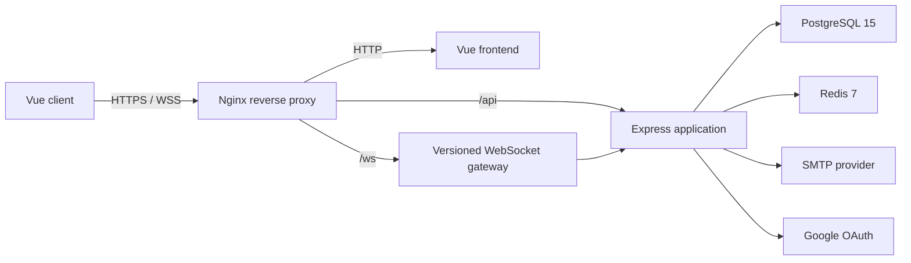
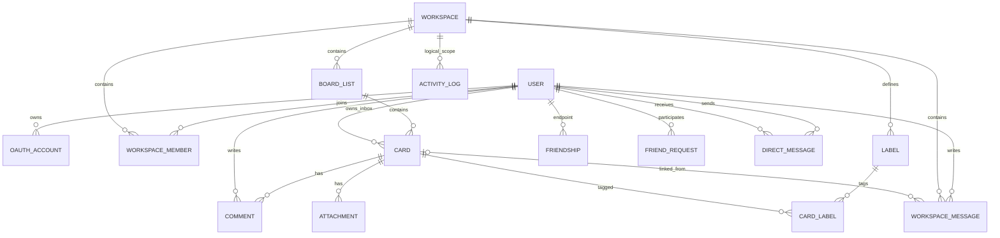

_This project has been created as part of the 42 curriculum by seungjuk, chakim, yeonjuki, injo, wchoe._

# TaskFlow

## Description

TaskFlow is a Trello-inspired collaboration prototype for organizing work in
role-based workspaces. It combines a Kanban board, a personal card inbox,
calendar views, invitations, workspace chat, presence, and realtime
synchronization in one Docker Compose application.

The project intentionally favors a compact, reviewable prototype over a
production-scale platform. Realtime transport is isolated behind a versioned
WebSocket protocol so future features can be added without coupling them to the
HTTP controllers or the Vue component tree.

### Key features

- Email/password authentication and Google OAuth 2.0 login.
- Rotating Redis-backed refresh sessions and short-lived JWT access tokens.
- Public and private workspaces with `OWNER`, `ADMIN`, `MEMBER`, and `VIEWER`
  roles.
- Redis-backed, one-time email invitation links accepted by any signed-in account.
- Kanban lists and cards with drag-and-drop reordering.
- Realtime list-level board synchronization across workspace members.
- Editable card titles, descriptions, start dates, and deadlines.
- A personal Inbox controlled from the workspace toolbox, rendered as a left
  split sidebar beside Board or Calendar on desktop and a focused full-page
  view on mobile. Desktop supports direct drag-and-drop between Inbox and board
  lists, including horizontal edge scrolling.
- A calendar that renders card start/deadline ranges as continuous weekly bars,
  plus advanced search across accessible workspaces, cards, labels, and people.
  Search supports mouse-selectable scopes, `/keyword` and slash-command filters,
  relevance/newest/name sorting, and URL-backed pagination.
- A workspace activity dashboard with selectable 7/30/90/365-day ranges,
  date-labelled contribution and issue-flow charts, current completion
  metrics, activity breakdowns, and a recent activity feed.
- Email-based friend requests with acceptance/rejection and realtime
  online/offline presence for accepted friends.
- A full messenger with workspace rooms, accepted-friend DMs, friend
  management, and realtime online status. On desktop it toggles from the right
  and its right-side directory rail can collapse to return space to the board;
  mobile uses a full-page view above the persistent bottom bar. Session-scoped
  unread counts for workspace messages, DMs, and workspace activity appear on
  each room and on the messenger header and workspace toolbox, capped visually
  at `99+`.
- Card-linked workspace messages that are also stored and displayed as card
  comments, direct comment writing from card details, and realtime team-member
  online status.
- Realtime workspace-member-joined activity folded into the related workspace
  room's unread count without a separate notification tab.
- HTTPS and WSS through Nginx, backed by PostgreSQL and Redis.

## Architecture



The REST API and PostgreSQL own durable application state. The realtime layer
authenticates the same users and publishes invalidation hints, chat delivery,
presence, and notification events. Browsers refetch only affected list
snapshots and perform a full snapshot reconciliation after reconnecting. Redis
stores refresh sessions, mail jobs, and invitation rate-limit counters.
Prototype channels and presence are intentionally held in one backend process.

## Instructions

### Prerequisites

- Docker Engine 24 or newer.
- Docker Compose v2.20 or newer.
- A browser that supports WebSockets.
- Google OAuth client credentials to test Google login.
- SMTP credentials to send workspace invitations.
- For a public Let's Encrypt certificate, a domain whose DNS points to a
  publicly reachable host and an OpenSSH client when using the optional reverse
  tunnel.

The containers pin the main runtime families used by the project:
Node.js 20, PostgreSQL 15, Redis 7, and Nginx stable Alpine. A host Node.js
installation is only needed when running tests outside Docker.

### 1. Configure the environment

```bash
cp .env.dev.example .env.dev
```

Review the values in `.env.dev` or `.env.prod` and replace every credential or
deployment-specific placeholder:

| Variable                                            | Purpose                                                                                               |
| --------------------------------------------------- | ----------------------------------------------------------------------------------------------------- |
| `NODE_ENV`                                          | Runtime mode; use `development` locally and `production` in deployment                                |
| `HTTPS_PORT`                                        | Host port exposed by the Nginx HTTPS entrypoint                                                       |
| `TLS_CERT_DIR`                                      | Production host directory containing `fullchain.pem` and `privkey.pem`; defaults to `./.taskflow/tls` |
| `DOMAIN`                                            | Public domain used for optional automatic Let's Encrypt HTTP-01 issuance                              |
| `CERTBOT_EMAIL`                                     | Email registered with Let's Encrypt; defaults to `admin@DOMAIN` when omitted                          |
| `SSH_TUNNEL_HOST`                                   | Optional `~/.ssh/config` host alias used for certificate and application reverse tunnels              |
| `LOCAL_HTTP_PORT`                                   | Local host port used by standalone Certbot; defaults to `8080`                                        |
| `POSTGRES_USER`, `POSTGRES_PASSWORD`, `POSTGRES_DB` | Credentials for the environment-specific PostgreSQL container                                         |
| `DATABASE_URL`                                      | Backend connection URL using the same PostgreSQL credentials                                          |
| `GOOGLE_CLIENT_ID`                                  | Google OAuth web client ID                                                                            |
| `GOOGLE_CLIENT_SECRET`                              | Google OAuth client secret                                                                            |
| `GOOGLE_REDIRECT_URI`                               | Exact registered callback; local default is `https://localhost:4430/oauth/google`                     |
| `APP_ORIGIN`                                        | Canonical browser origin; local default is `https://localhost:4430`                                   |
| `JWT_ACCESS_SECRET`                                 | Random secret of at least 32 characters                                                               |
| `SMTP_HOST`, `SMTP_PORT`                            | SMTP server and port                                                                                  |
| `SMTP_USER`, `SMTP_PASS`                            | SMTP credentials                                                                                      |
| `SMTP_FROM`                                         | Sender shown on invitation messages                                                                   |
| `OAUTH_AUTO_LINK_VERIFIED_EMAIL`                    | Toy-project option for linking a verified Google email to an existing local user                      |
| `WS_*`                                              | Optional WebSocket timeout, heartbeat, payload, and rate-limit tuning                                 |
| `ALLOW_DB_SEED`                                     | Explicit development-only seed guard; keep this `false` in production                                 |
| `DEV_SEED_EMAIL`, `DEV_SEED_PASSWORD`               | Development fixture owner login and shared fixture password; used only when seeding is enabled        |

A suitable development JWT secret can be generated with:

```bash
openssl rand -base64 48
```

Placeholder Google and SMTP values are enough to exercise password
authentication and the board locally, but their related integrations will not
work until valid credentials are supplied.

### 2. Register the OAuth callback

Create a Google OAuth 2.0 Web application and add this authorized redirect URI:

```text
https://localhost:4430/oauth/google
```

The canonical backend route
`/api/auth/oauth/callback/google` is also supported. For any external
deployment, register the exact public HTTPS callback and update both
`APP_ORIGIN` and `GOOGLE_REDIRECT_URI`.

### 3. Build and run

```bash
make dev-up
make dev-seed
```

The backend entrypoint generates the Prisma client and applies pending
migrations automatically. Nginx generates a self-signed development
certificate when no certificate is mounted.

The seed command creates two workspaces with role-based members, 24 board and
Inbox cards, relative Calendar dates, Dashboard activity, labels, comments,
attachments, friendships, requests, workspace messages, and DMs.
The dates are recalculated around the day the seed runs so recent activity and
upcoming work remain visible.

All fixture accounts use `DEV_SEED_PASSWORD` from `.env.dev`:

| Role/scenario                         | Email                                                   |
| ------------------------------------- | ------------------------------------------------------- |
| Product workspace `OWNER`             | Value of `DEV_SEED_EMAIL` (`dev@local.test` by default) |
| Product workspace `ADMIN`             | `alex.admin@local.test`                                 |
| Product workspace `MEMBER`            | `mina.member@local.test`                                |
| Product workspace `VIEWER`            | `joon.viewer@local.test`                                |
| Public non-member and pending request | `guest.pending@local.test`                              |

Repeated seed runs restore fixed fixture records without deleting unrelated
user-created workspaces or cards. They do reset activity history for the two
fixture workspaces so the Dashboard remains deterministic. Never run the seed
against production.

Open:

- Application: `https://localhost:4430`
- Health check: `https://localhost:4430/api/health`

The browser will warn about the self-signed local certificate. Accept it only
for this development environment.

Useful lifecycle commands:

```bash
make dev-logs
make dev-down
```

`make`, `make up`, `make down`, and `make logs` remain aliases for the
development commands. `make dev-reset` removes only the `taskflow-dev`
containers and volumes and therefore deletes all development data.

### 4. Run Production

Create a separate production environment file and replace every placeholder:

```bash
cp .env.prod.example .env.prod
```

At minimum, replace the production database, JWT, OAuth, and SMTP credentials.
For a public domain, also set `DOMAIN`, `CERTBOT_EMAIL`, `APP_ORIGIN`, and
`GOOGLE_REDIRECT_URI` to the exact deployed HTTPS origin. The domain's A or
AAAA record must resolve to the public host that receives the certificate and
application tunnels.

If the application runs behind a separate public VPS, configure key-based SSH
access under a host alias instead of putting a password or private-key contents
in `.env.prod`:

```sshconfig
Host taskflow-tunnel
  HostName vps.example.com
  User root
  IdentityFile ~/.ssh/id_ed25519_taskflow
```

Then enable the tunnel in `.env.prod`:

```dotenv
DOMAIN=taskflow.example.com
CERTBOT_EMAIL=admin@example.com
SSH_TUNNEL_HOST=taskflow-tunnel
LOCAL_HTTP_PORT=8080
APP_ORIGIN=https://taskflow.example.com
GOOGLE_REDIRECT_URI=https://taskflow.example.com/oauth/google
```

The SSH server must allow remote forwarding and public reverse-tunnel binds,
and its firewall must accept ports 80 and 443. Those remote ports must also be
free. Standard OpenSSH permits remote forwarding of privileged ports below
1024 only for a root login, so the tunnel alias normally needs a carefully
controlled root account and a dedicated key. If root SSH access is prohibited,
the scripts as written require an equivalent VPS-side proxy or port-redirection
arrangement. The server may also require `AllowTcpForwarding yes` and
`GatewayPorts yes`, or equivalent provider settings. The scripts use
non-interactive SSH, so verify the host fingerprint and key-based connection
before the first run. If no SSH tunnel is used, public port 80 must instead be
forwarded to `LOCAL_HTTP_PORT`; setting `LOCAL_HTTP_PORT=80` is also possible
when the host can bind that port directly.

Start the production stack with:

```bash
make prod-up
```

Before Compose starts, `certbot-issue.sh` runs Certbot in standalone mode on
`LOCAL_HTTP_PORT`. When `SSH_TUNNEL_HOST` is configured, a temporary reverse
tunnel exposes that listener as the VPS's port 80 for the Let's Encrypt HTTP-01
challenge and closes immediately afterward. A newly issued or previously
stored certificate is copied to `TLS_CERT_DIR`, then the production services
start. Finally, `app-tunnel.sh` keeps the VPS's port 443 forwarded to the local
`HTTPS_PORT` until `make prod-down` stops the tunnel.

Production uses compiled backend and frontend images without source mounts.
Its PostgreSQL and Redis volumes belong to the separate `taskflow-prod`
Compose project, so development resets cannot delete production data. Use
`make prod-logs` and `make prod-down` for its lifecycle.

Certbot keeps its ACME account and original certificate files under
`.taskflow/letsencrypt/`. Nginx reads the installed copies from
`${TLS_CERT_DIR:-./.taskflow/tls}/fullchain.pem` and `privkey.pem`. The
persistent tunnel records its PID and diagnostics in
`.taskflow/app-tunnel.pid` and `.taskflow/app-tunnel.log`. Both `.env.prod` and
the entire `.taskflow/` directory are ignored by Git; keep them that way, use
restrictive permissions, and never commit or share the TLS private key, ACME
account data, or SSH private key.

When `DOMAIN` is unset or certificate issuance fails, startup continues and
the Nginx entrypoint generates or keeps a self-signed certificate. A manually
managed certificate remains supported by placing `fullchain.pem` and
`privkey.pem` in `TLS_CERT_DIR` before startup. Renew a Let's Encrypt
certificate with:

```bash
make prod-renew
```

The renewal target stops Nginx, briefly opens the HTTP-01 tunnel when
configured, copies the renewed files into `TLS_CERT_DIR`, and starts the
services again. If renewal fails, the installed certificate is kept. Renewal
is not scheduled by the project, so run this command before expiration or
invoke it from an external scheduler. Never enable `ALLOW_DB_SEED` in
production.

### 5. Run checks

Backend test files are centralized under `backend/test`, and frontend test
files are centralized under `frontend/test`. Run their package scripts from
the respective package roots so each suite uses its own TypeScript and test
runner configuration:

```bash
cd backend
npm install
npm run typecheck
npm test

cd ../frontend
npm install
npm test
npm run build
```

Backend integration tests create local HTTP and WebSocket listeners, so the
environment running the suite must allow loopback port binding.

## Basic usage

1. Create an account or sign in with Google.
2. Create a private or public workspace.
3. Add lists and cards, then drag them to reorder or move them.
4. Open a card to edit its details and dates.
5. Open Inbox from the bottom workspace toolbox. On desktop, use its split
   sidebar beside Board or Calendar and drag cards between Inbox and board
   lists. Dropping a board card directly on the closed Inbox tool moves it
   without opening the sidebar; on mobile, use the focused Inbox page.
6. Invite a registered or future user by email from the workspace share menu.
7. Toggle Chat from the bottom toolbox, then choose a workspace room, manage
   friends, or start a DM. On desktop it opens as a right sidebar whose
   directory rail can collapse; on mobile it becomes a full page.
8. Select a card, or drop a board card onto the open right-side workspace chat,
   before sending a message to also record that text in the card's comments.
   Dropping onto the closed Chat tool opens the current workspace room with
   that card already attached.
9. See team online status and member management from the workspace top bar,
   search accessible workspaces, cards, labels, and people with filters,
   sorting, and pagination, or use the bottom toolbox to switch between the
   board, Calendar, Dashboard, and workspace list.
10. Use a card's Complete/Reopen action to change its own completion state
    without moving it. List completion markers are optional visual hints only;
    the dashboard history follows the card state.

Workspace permissions are deliberately small:

| Role              | Read board | Workspace chat | Edit lists/cards | Invite/manage members | Edit workspace | Delete workspace |
| ----------------- | :--------: | :------------: | :--------------: | :-------------------: | :------------: | :--------------: |
| Public non-member |    Yes     |       No       |        No        |          No           |       No       |        No        |
| `VIEWER`          |    Yes     |      Yes       |        No        |          No           |       No       |        No        |
| `MEMBER`          |    Yes     |      Yes       |       Yes        |          No           |       No       |        No        |
| `ADMIN`           |    Yes     |      Yes       |       Yes        |          Yes          |      Yes       |        No        |
| `OWNER`           |    Yes     |      Yes       |       Yes        |          Yes          |      Yes       |       Yes        |

OWNER and ADMIN can assign `ADMIN`, `MEMBER`, or `VIEWER` to eligible
non-owner members from the team-management dialog. The OWNER role itself is
not editable there; ownership transfer remains a separate workflow, and an
ADMIN cannot change an OWNER. The service also prevents removing the final
owner.

## Technical stack

| Area              | Technology                            | Why it was selected                                                               |
| ----------------- | ------------------------------------- | --------------------------------------------------------------------------------- |
| Frontend          | Vue 3, TypeScript, Vite, Vue Router   | Small component model, strong typing, and fast prototype iteration                |
| Styling           | Tailwind CSS plus project CSS         | Fast layout work while keeping reusable component styles                          |
| Board interaction | `vuedraggable`                        | Browser drag-and-drop with a small Vue integration surface                        |
| Backend           | Express 5, TypeScript, Zod            | Minimal HTTP framework with explicit validation and readable services             |
| Realtime          | `ws` with a versioned JSON envelope   | Direct control over authentication, heartbeat, routing, and future event handlers |
| ORM               | Prisma                                | Typed PostgreSQL queries, migrations, relations, and transactions                 |
| Durable storage   | PostgreSQL 15                         | Relational integrity for workspaces, roles, boards, and audit data                |
| Ephemeral storage | Redis 7                               | Refresh sessions, mail queue, and invitation throttling                           |
| Authentication    | JWT, Node `scrypt`, Google OAuth/OIDC | Stateless access checks plus revocable sessions and social login                  |
| Email             | Nodemailer                            | Provider-neutral SMTP invitation delivery                                         |
| Edge/runtime      | Nginx and Docker Compose              | One HTTPS/WSS entrypoint and reproducible local services                          |
| Testing           | Node test runner and Vitest           | Lightweight backend integration/unit tests and frontend behavior tests            |

## Database schema



The Prisma models map to plural PostgreSQL table names. `ActivityLogs` is
created and populated by a SQL trigger migration, then exposed through a
read-only Prisma model for dashboard aggregation.

| Table               | Important fields and types                                                                                                                                            | Relationship or rule                                                                         |
| ------------------- | --------------------------------------------------------------------------------------------------------------------------------------------------------------------- | -------------------------------------------------------------------------------------------- |
| `Users`             | `id UUID`, `email String`, `password_hash String?`, `name String`, `profile_image_url String?`, `headline String`, `linkedin_url String?`                             | Email is unique; OAuth-only users may have no password hash                                  |
| `OAuthAccounts`     | `id UUID`, `user_id UUID`, `provider String`, `provider_id String`                                                                                                    | Unique provider/provider ID pair                                                             |
| `Friendships`       | `user_low_id UUID`, `user_high_id UUID`, `created_at DateTime`                                                                                                        | Sorted composite key represents one undirected friendship                                    |
| `FriendRequests`    | `user_low_id UUID`, `user_high_id UUID`, `requested_by_id UUID`, `created_at DateTime`                                                                                | Canonical pending pair; deleted on accept, reject, or cancel                                 |
| `DirectMessages`    | `id UUID`, `sender_user_id UUID`, `recipient_user_id UUID`, `content Text`, `created_at DateTime`                                                                     | Append-only messages; API access requires the friendship to remain accepted                  |
| `Workspaces`        | `id UUID`, `name String`, `is_public Boolean`                                                                                                                         | Parent of members, lists, and labels                                                         |
| `WorkspaceMembers`  | `workspace_id UUID`, `user_id UUID`, `role Role`                                                                                                                      | Composite key; role is `OWNER`, `ADMIN`, `MEMBER`, or `VIEWER`                               |
| `WorkspaceMessages` | `id UUID`, `workspace_id UUID`, `user_id UUID`, `card_id UUID?`, `content Text`, `created_at DateTime`                                                                | Append-only default-room messages; an optional card link is cleared if the card is deleted   |
| `Lists`             | `id UUID`, `workspace_id UUID`, `name String`, `sequence Float`                                                                                                       | Fractional sequence supports reordering without rewriting every sibling                      |
| `Cards`             | `id UUID`, `list_id UUID?`, `user_id UUID?`, `title String`, `description Text`, `is_completed Boolean`, `start_at DateTime?`, `deadline DateTime?`, `sequence Float` | A null `list_id` denotes a personal inbox card; completion is independent from list position |
| `Labels`            | `id UUID`, `workspace_id UUID`, `label_name String`, `label_color String`                                                                                             | Labels are workspace-scoped                                                                  |
| `CardLabels`        | `label_id UUID`, `card_id UUID`                                                                                                                                       | Composite card-to-label relation                                                             |
| `Attachments`       | `id UUID`, `card_id UUID`, `file_url String?`, `file_name String?`, `storage_key String?`, `mime_type String?`, `size_bytes Int?`                                     | Stores metadata for legacy URLs or files persisted in the protected attachment volume        |
| `Comments`          | `id UUID`, `card_id UUID`, `user_id UUID`, `comment_str String`                                                                                                       | Editable, soft-deletable card comments                                                       |
| `ActivityLogs`      | `id UUID`, `workspace_id UUID`, `actor_user_id UUID?`, `operation enum`, `event_type enum`, `target_type enum`, `target_id Text`, `transaction_id BigInt`             | Append-only workspace activity records written by triggers                                   |

Most domain models also carry `created_at/by`, `updated_at/by`, and
`deleted_at/by` audit fields. Soft-deleted rows remain available for audit
history but are filtered from normal application reads.

## Features and contributors

Git history uses several aliases. The table normalizes the confirmed aliases to
the corresponding 42 logins.

| Feature                           | Implementation summary                                                                                                                | Repository contributors                           |
| --------------------------------- | ------------------------------------------------------------------------------------------------------------------------------------- | ------------------------------------------------- |
| Authentication and account        | Password login, Google OAuth, refresh rotation, profile edit/delete, and protected routing                                            | `seungjuk`, `wchoe`                               |
| User profiles and avatars         | Public profile modal/page, headline and LinkedIn fields, validated avatar upload/removal, and fallback avatars                        | `seungjuk`, `injo`, `wchoe`                       |
| Workspace and permissions         | CRUD, role checks, member removal, final-owner guard, public data projection, and ownership policy                                    | `chakim`, `seungjuk`, `wchoe`                     |
| Email invitations                 | One-time bearer invitations in Redis, preview/accept flow, mail queue, sender limits, locking, and revocation                         | `chakim`, `wchoe`                                 |
| Lists and cards                   | Prisma services, fractional ordering, drag-and-drop, editable details, dates, and completion state                                    | `injo`, `yeonjuki`, `wchoe`, `seungjuk`           |
| Labels, comments, and attachments | Workspace labels, card comments with edit/delete, card-linked chat comments, and validated file upload/preview/download/delete        | `chakim`, `seungjuk`, `injo`, `wchoe`, `yeonjuki` |
| Personal inbox                    | API-backed cards, board/inbox drag round trip, and edge scrolling                                                                     | `seungjuk`                                        |
| Calendar                          | Workspace card date ranges rendered as continuous weekly bars with cross-browser date input                                           | `seungjuk`, `wchoe`                               |
| Advanced search                   | Server-side workspace/card/people discovery with scopes, labels, slash commands, sorting, and pagination                              | `seungjuk`, `wchoe`                               |
| Activity dashboard                | Selectable-period trigger-backed contribution heatmap, dated activity feed, issue flow, completion metrics, and list/activity charts  | `seungjuk`                                        |
| Friends, DMs, and presence        | Request/accept/reject/cancel flow, symmetric friendships, direct messages, unified messenger, unread state, and online/offline events | `seungjuk`, `yeonjuki`, `injo`, `wchoe`           |
| Realtime foundation               | Authenticated protocol, reconnect, refresh, heartbeat, limits, routing, drain                                                         | `seungjuk`                                        |
| Workspace realtime and chat       | Member-only channels, targeted list reconciliation, team presence, and persistent group chat                                          | `seungjuk`                                        |
| Accessibility and responsive UI   | Keyboard board movement, modal focus handling, responsive messenger/toolbox layouts, and Tailwind migration                           | `chakim`, `yeonjuki`, `wchoe`                     |
| Infrastructure and quality        | HTTPS/WSS Nginx proxy, development/production Compose targets, persistent upload volume, CI, linting, formatting, and tests           | `yeonjuki`, `injo`, `wchoe`                       |
| Database and activity audit       | Core Prisma schema, migrations, indexes, and trigger-based activity log                                                               | `yeonjuki`, `injo`, `seungjuk`, `chakim`          |

## Team information

The current 42 team roles are:

| Login      | Role            | Main responsibility                                                                   |
| ---------- | --------------- | ------------------------------------------------------------------------------------- |
| `seungjuk` | Product Owner   | Product direction, requirements, priorities, and cross-feature integration            |
| `chakim`   | Project Manager | Planning workflow, coordination, workspace/member and invitation workstream           |
| `yeonjuki` | Tech Lead       | Backend structure, infrastructure decisions, card module, and technical review        |
| `injo`     | Developer       | Relational schema, Prisma list/card services, and drag-and-drop board integration     |
| `wchoe`    | Developer       | Vue UI structure, routing, shared components, API integration, and frontend hardening |

Confirmed repository aliases are: `wchoe` as `KHR416`; `seungjuk` as
`seankim96`/`Sean Kim`; `chakim` as `Saususge`; `yeonjuki` as
`yeonjunky`/`yeonjunkim`; and `injo` as `carryplz`/`조인철`. Automated authors
and co-authors are excluded from the contributor summaries.

## Project management

- The shared Trello board was the planning source of truth.
- Cards moved through `Backlog` → `To-do` → `WIP` → `Review` → `Done`.
- Contributor-colored labels identified ownership; `Waiting` marked blockers
  and `Stretch` marked lower-priority goals.
- Work was split into two-to-three-day checklist items, implemented on feature
  branches, and moved to review with relevant links and context on the card.
- GitHub branches and pull requests carried implementation and integration.
  Teammates reviewed changes, requested revisions where needed, approved the
  final result, and then merged it into `main`.
- KakaoTalk was used for day-to-day communication, sharing blockers, scheduling
  discussions, and urgent coordination.
- Trello card descriptions and comments preserved task context, while GitHub PR
  discussions preserved code-level review decisions.

## Modules

The subject requires 14 points. Each Major module is worth 2 points and each
Minor module is worth 1 point. This table claims only modules whose complete
requirements can be demonstrated from the current source; final acceptance
remains the evaluator's decision.

| Module                                                          | Level | Points | Justification and implementation                                                                                                                                                             | Contributors                                      |
| --------------------------------------------------------------- | ----- | -----: | -------------------------------------------------------------------------------------------------------------------------------------------------------------------------------------------- | ------------------------------------------------- |
| Use a frontend and backend framework                            | Major |      2 | Vue 3 frontend and Express 5 backend, both in TypeScript                                                                                                                                     | `wchoe`, `yeonjuki`, `injo`, `chakim`, `seungjuk` |
| Implement real-time features using WebSockets                   | Major |      2 | Authenticated WSS protocol with cross-client updates, channel broadcasting, reconnect, token refresh, heartbeat, graceful disconnect, and server drain                                       | `seungjuk`                                        |
| Allow users to interact with other users                        | Major |      2 | Persistent direct and workspace chat, public profile views, friend request/removal flows, friend lists, and online presence                                                                  | `seungjuk`, `yeonjuki`, `injo`, `wchoe`           |
| Use an ORM                                                      | Minor |      1 | Prisma schema, relations, transactions, and migrations over PostgreSQL                                                                                                                       | `yeonjuki`, `injo`, `chakim`, `wchoe`             |
| Real-time collaborative features                                | Minor |      1 | Shared workspaces synchronize list, card, label, membership, chat-link, and presence changes across connected clients                                                                        | `seungjuk`                                        |
| Advanced search with filters, sorting, and pagination           | Minor |      1 | Workspace-scoped card and label filters, people discovery, slash commands, relevance/newest/name sorting, and URL-backed pagination                                                          | `seungjuk`, `wchoe`                               |
| File upload and management system                               | Minor |      1 | Card attachments support multiple media types, client/server validation, content-signature checks, access-controlled storage, image preview, progress, download, and deletion                | `injo`                                            |
| Standard user management and authentication                     | Major |      2 | Profile editing, validated avatar upload/removal with fallback avatars, public profile views, friends, and realtime online status                                                            | `seungjuk`, `injo`, `yeonjuki`, `wchoe`           |
| Remote authentication with OAuth 2.0                            | Minor |      1 | Google Authorization Code flow with state, nonce, ID-token verification, and account linking policy                                                                                          | `seungjuk`                                        |
| Organization system                                             | Major |      2 | Workspace create/edit/delete, invitations, member add/remove, role-aware views/actions, and list/card resources within each workspace                                                        | `chakim`, `injo`, `wchoe`, `seungjuk`             |
| User activity analytics and insights dashboard                  | Minor |      1 | Trigger-backed contribution heatmap, dated activity feed, issue flow, completion metrics, list/activity charts, and selectable periods                                                       | `seungjuk`                                        |
| Custom module: separate development and production environments | Minor |      1 | Dedicated Compose overlays and environment files, independent project and volume namespaces, HMR development targets, compiled production images, and separate lifecycle commands            | `wchoe`                                           |
| Custom module: public custom-domain deployment                  | Major |      2 | DNS-based public HTTPS deployment with scripted Let's Encrypt HTTP-01 issuance and renewal, persistent certificates, self-signed fallback, and optional SSH reverse tunnels for ports 80/443 | `yeonjuki`                                        |
| **Currently defensible total**                                  |       | **19** | Exceeds the 14-point subject requirement by 5 points                                                                                                                                         |                                                   |

The two custom modules cover separate responsibilities. The environment module
provides reproducible development and production execution. The domain module
adds the public deployment lifecycle on top: ACME certificate issuance and
renewal, certificate persistence, DNS-bound HTTPS configuration, and optional
SSH tunnelling when the application is hosted behind a separate public VPS.

The advanced analytics dashboard is not claimed: although its charts, live
updates, and date filters are implemented, the Major module also requires PDF
or CSV export. Advanced permissions, a public API, complete notifications,
SSR, PWA, and complete WCAG 2.1 AA compliance are likewise not claimed because
their full subject requirements are not currently demonstrated.

## Individual contributions and challenges

### seungjuk — Product Owner

- Implemented password authentication and Google OAuth, including account
  linking, refresh-token rotation, logout, and account lifecycle handling.
- Designed the authenticated WebSocket foundation and hardened reconnect,
  disconnect, heartbeat, token refresh, presence, and graceful shutdown flows.
- Added workspace synchronization and team chat, then integrated friends,
  direct messages, unread state, notifications, and presence into the unified
  messenger.
- Replaced prototype data in the inbox and calendar, implemented public
  profiles and advanced search, and built the activity analytics dashboard.
- Centralized workspace permission checks, enforced owner/role hierarchy, and
  limited private member data exposed to public viewers.
- Challenge: live state could diverge during reconnects, shutdown, or concurrent
  workspace updates. Resolution: introduced authenticated channel routing,
  explicit lifecycle handling, targeted reconciliation events, and integration
  tests for failure paths.

### chakim — Project Manager

- Implemented workspace CRUD across the Express service and Vue interface,
  including creation, editing, deletion, member role changes, member removal,
  and the final-owner guard.
- Built the invitation mail flow with Nodemailer, templates, Redis-backed
  queues, SMTP configuration, sender limits, and graceful worker shutdown.
- Added the label backend and frontend, displayed labels on board cards, and
  removed the obsolete list-level completion model.
- Improved keyboard accessibility with list/card movement controls and modal
  focus trapping, and added signup rate limiting and attachment indexing.
- Challenge: membership and invitation mutations could race or leave partial
  state. Resolution: wrapped search-then-mutate operations in transactions,
  protected owner invariants, queued mail delivery, and rate-limited entry
  points.

### yeonjuki — Tech Lead

- Established the modular backend structure and implemented the initial card
  module used by the board domain.
- Implemented HTTPS through Nginx, self-signed certificate generation, reverse
  tunneling documentation, and Vite host configuration for remote development.
- Built the realtime friend-request lifecycle and refined the friends and
  messaging interfaces.
- Led the Tailwind migration for existing styles and improved responsive
  behavior across the toolbox, messenger, and card-detail views.
- Challenge: REST, OAuth callbacks, frontend assets, and WSS needed to work from
  one secure origin. Resolution: routed them through one Nginx TLS entrypoint
  and aligned the development tunnel and allowed-host configuration.

### injo — Developer

- Created the initial Prisma schema and migration, then implemented the list
  service and rewrote card persistence around Prisma and shared error handling.
- Connected board lists and cards to the API with drag-and-drop ordering and
  added explicit list/card creation actions.
- Implemented card attachments and avatar uploads, including file-type and
  content-signature validation, filename normalization, access-controlled
  downloads, deletion, and persistent Docker storage.
- Made membership transitions atomic, fixed Redis startup blocking, and
  consolidated the friend request/list interface.
- Challenge: uploaded files could be spoofed, lost on container recreation, or
  exposed without membership checks. Resolution: verified magic bytes, stored
  normalized server-side names in a dedicated volume, and authorized every
  attachment operation through its workspace.

### wchoe — Developer

- Built the initial Vue application structure for authentication, workspaces,
  boards, and calendars, then extracted shared layouts, components, styles, and
  the authenticated API client.
- Replaced mock workspace and login data, hardened card movement and API error
  paths, and kept role-dependent controls aligned with backend authorization.
- Implemented one-time Redis invitations and strengthened them with scoped
  locking, serialized sends, sender limits, role preservation, revocation, and
  race-focused tests.
- Added the unified search endpoint and frontend integration, comment
  edit/delete flows with membership and race checks, and messenger friend
  request unread state.
- Added development fixtures, production/development container targets, CI
  quality gates, formatting and lint tooling, dependency security fixes, and
  the documented run workflows.
- Refined keyboard board controls into focus-driven popovers and fixed chat card
  links so only previously linked, subsequently deleted cards show as deleted.
- Challenge: asynchronous invitations, comments, and UI state were vulnerable
  to races and stale responses. Resolution: used scoped locks and atomic server
  operations, guarded frontend mutations, centralized requests, and added
  regression tests and CI checks.

## Resources

Primary references used while designing and implementing the project:

- [Vue documentation](https://vuejs.org/guide/introduction.html)
- [Vue Router documentation](https://router.vuejs.org/)
- [Express documentation](https://expressjs.com/)
- [Prisma documentation](https://www.prisma.io/docs)
- [PostgreSQL documentation](https://www.postgresql.org/docs/15/)
- [Redis documentation](https://redis.io/docs/latest/)
- [MDN WebSocket API](https://developer.mozilla.org/en-US/docs/Web/API/WebSocket)
- [RFC 6455: The WebSocket Protocol](https://www.rfc-editor.org/rfc/rfc6455)
- [OWASP WebSocket Security Cheat Sheet](https://cheatsheetseries.owasp.org/cheatsheets/WebSocket_Security_Cheat_Sheet.html)
- [Google OAuth 2.0 for web server applications](https://developers.google.com/identity/protocols/oauth2/web-server)
- [Nodemailer documentation](https://nodemailer.com/)
- [Docker Compose documentation](https://docs.docker.com/compose/)

### AI usage

AI assistance was used for bounded engineering support, including:

- auditing the existing repository before selecting implementation scope;
- drafting and reviewing the extensible WebSocket lifecycle and event routing;
- identifying authentication, permission, privacy, and shutdown edge cases;
- proposing focused refactors that remove mock data without changing the
  prototype's intended behavior;
- drafting unit/integration test cases and reconciling DTO documentation with
  implementation;
- organizing this README from source code, tests, migrations, Git history, and
  the team planning document.

Humans remained responsible for product scope and final decisions. Suggested
changes were reviewed as diffs and accepted only after type checks, automated
tests, and production builds. No user secrets or `.env` contents were supplied
to an AI system.
